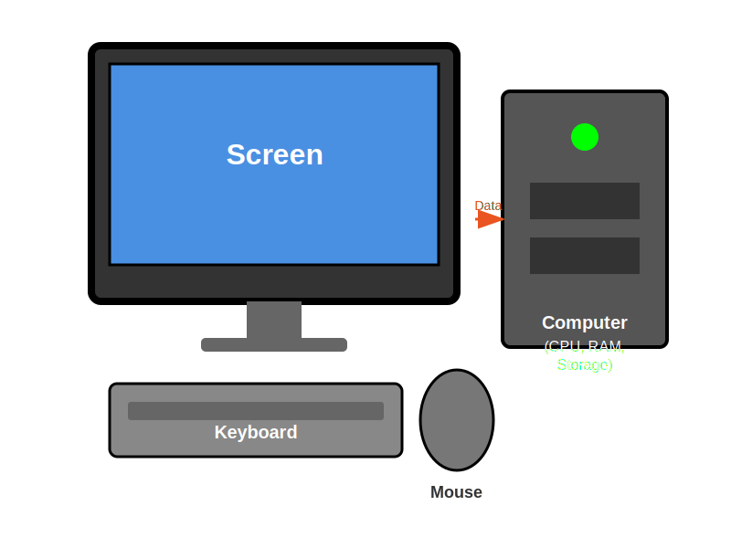

# Chapter 1: What Is a Computer? 💻

Okay, real talk: You probably think you know what a computer is. It's that thing on your desk that you use for homework sometimes, right? WRONG! Or... well, not ENTIRELY wrong, but there's SO much more to it!

Your laptop 💻 is a computer. But so is your tablet 📱. And your gaming console 🎮. And even that smart speaker 🔊 that plays music when you ask it to. Your parents' phones? Computers. That fancy watch ⌚ your teacher wears? Computer. Even some refrigerators 🧊 are computers now! (Yeah, that's weird, but it's true!)

## So What Actually IS a Computer? 🤔

Here's the cool part: EVERY computer - whether it's controlling a rocket ship 🚀 or just showing you videos of cats 🐱 falling off things - does the same four basic jobs:

1. **Takes information in** (input) - Like when you press buttons or type
2. **Thinks about it** (processing) - The computer's brain figures stuff out
3. **Gives you results** (output) - Shows you what happened on screen or plays sounds
4. **Remembers things** (storage) - Saves your stuff so you don't lose it

That's it! From the computer running your favorite game to the massive supercomputers that predict the weather, they ALL do these four things. It's just like how every car has wheels, an engine, and steering - it doesn't matter if it's a tiny car or a giant truck!

Let's meet the parts that make this happen!

## The Brain: The CPU (A.K.A. The Speed Demon!) 🧠⚡

![Screenshot Placeholder: Diagram of CPU]

Inside your computer - right now, while you're reading this - there's a tiny chip about the size of a postage stamp 📮. It's called the **CPU** (Central Processing Unit), and it's basically your computer's brain 🧠. But here's the wild part: this "brain" can think BILLIONS of times per second!

**Imagine this:** You're playing Minecraft 🎮. You place a block. In that split second, the CPU has to:
- Figure out where you clicked
- Check if you're allowed to place a block there
- Update the world
- Tell your graphics card to show the new block
- Update the physics so gravity works
- Check if any mobs are nearby
- Save your progress
- ...and about a million other things!

And it does ALL of that faster than you can blink! Like, literally. A blink takes about 150 milliseconds. A modern CPU can do 150 MILLION calculations in that time!

**Here's another way to think about it:** Remember in school when you have to do multiplication tables? Like 7 × 8? It takes you maybe a second or two to think "Okay, that's 56." Your CPU could solve that problem 2 BILLION times in that same second. If your teacher gave the CPU a math worksheet, it would finish every math problem ever written by humans in about... a few minutes. Maybe less.

The speed of a CPU is measured in **gigahertz** (GHz). My computer has a 2.5 GHz CPU, which means it can do 2.5 billion calculations every single second. Your brain is doing something amazing right now - reading and understanding these words - but a CPU? It's doing math problems at speeds that would make your head spin!

**🤯 Mind-Blowing Fun Fact:** Your CPU has billions of tiny switches inside it called transistors. BILLIONS. More than there are people on Earth 🌍! And they're so small that you could fit thousands of them on something the size of a period at the end of this sentence.

**Try This!**

Let's find out how fast YOUR CPU is:

1. Click the Applications menu (the Ubuntu logo at the bottom-left)
2. Type "Settings" and open it
3. Click "About" on the left
4. Look for "Processor" - that's your CPU!

Is it 2.0 GHz? 3.5 GHz? Whatever it is, that number means "billions of things per second." Pretty cool, right?

## Short-Term Memory: RAM (Your Computer's Desk Space!) 🗂️

![Screenshot Placeholder: RAM stick]

**RAM** stands for Random Access Memory, but here's a MUCH better way to think about it:

Imagine you're doing homework 📝. You have your math book 📕 open, your notebook 📓 out, a pencil ✏️, maybe a calculator 🧮, and a pack of gum (because gum helps you think, obviously). All of that stuff is on your DESK where you can reach it instantly.

That's RAM! It's your computer's desk space - the place where it keeps everything it's working on RIGHT NOW.

**Here's what happens:** Let's say you're making a video 🎬 of yourself doing an epic trick shot in basketball 🏀. You have:
- The video editor open 🎞️
- Your video file loaded 📹
- Music playing in the background 🎵
- Firefox open with a YouTube tutorial on editing 📺
- Maybe even a game in the background because you got distracted (no judgment! 😅)

All of that is sitting in RAM - your computer's desk - ready to use instantly. The CPU can grab anything from RAM super duper fast, just like you can grab your pencil without getting up.

**But here's the catch:** When you close programs or turn off your computer, RAM forgets EVERYTHING. It's like a magic desk ✨ that clears itself every time you stand up. That's why you need to save your work! If you don't save, and the power goes out... POOF! 💨 Everything in RAM disappears like it never existed.

The more RAM you have, the bigger your desk is. With tons of RAM, you can have like 50 things open at once without your computer getting confused or slow. With not much RAM? Your computer starts struggling, like trying to do homework on a tiny table with no space.

**🎮 Real Kid Scenario:** You know how sometimes you're playing a game and it starts lagging and getting all choppy? A lot of times, that's because your RAM is full! Your computer is trying to juggle 🤹 too many things at once with not enough desk space. Closing some programs is like cleaning off your desk - suddenly everything works better!

**Try This!**

Let's see how much RAM (desk space) your computer has:

1. Click Applications (the Ubuntu logo again)
2. Type "Settings" and open it
3. Click "About"
4. Look for "Memory" - that's your RAM!

Most computers have between 4 GB and 16 GB. That's gigabytes, which means billions of bytes. A byte is basically enough memory to store one letter. So 4 GB? That's enough to store about 4 BILLION letters! Or... like a million pages of text. Or... okay, you get the idea. It's a lot!

**Quick Challenge:** How many programs do you have open right now? Count them! Each one is using some of your RAM. If you want to see your computer run faster, try closing the ones you're not actually using!

## Long-Term Memory: Storage (Your Computer's Backpack!) 🎒

![Screenshot Placeholder: Hard drive or SSD]

If RAM is your desk, then **storage** is your backpack 🎒. It's where you keep ALL your stuff when you're not using it:

- Every photo you've ever taken 📸
- Every video you've ever made 🎥
- All your games 🎮
- Every document you've saved 📄
- All your music 🎵
- Even Ubuntu itself lives in storage!

The amazing thing about storage? It remembers everything even when the computer is turned off! You can shut down your computer, unplug it, throw it in a backpack, fly to another country ✈️, turn it back on, and all your stuff is still there!

There are two main types of storage, and they're pretty different:

### Hard Disk Drive (HDD) - The Old School Spinning Disk 💿

Inside an HDD, there are actual spinning disks (they look like DVDs! 📀) that spin around super fast - like 5,400 to 7,200 times per MINUTE! A tiny arm reads and writes data on these disks, kind of like an old record player 🎶.

**The Good:** ✅
- Cheap! 💰 You can get TONS of storage for not much money
- Great for storing huge files like videos or game collections

**The Not-So-Good:** ⚠️
- Slower than SSDs
- Has moving parts that can break if you drop your laptop 💔
- Makes a little whirring noise (some people think it sounds cool though!)

### Solid State Drive (SSD) - The Fast New Hotness 🔥

SSDs have no moving parts AT ALL. They're basically a bunch of memory chips packed together, kind of like a giant USB stick.

**The Good:** ✅
- SUPER fast! ⚡ Your computer starts up in seconds instead of minutes
- No moving parts = won't break if you bump your laptop 💪
- Completely silent 🤫
- Uses less power (better battery life! 🔋)

**The Not-So-Good:** ⚠️
- More expensive than HDDs 💸
- Usually has less total space (but that's changing!)

Most new laptops use SSDs because they're SO much faster. It's the difference between waiting 30 seconds ⏰ for your computer to start up versus waiting 5 seconds ⚡. Trust me, once you've used an SSD, going back to an HDD feels like watching videos in slow motion! 🐌

**Try This!**

Let's check what kind of storage you have and see how much space you're using:

1. Click "Show Applications" (the Ubuntu logo)
2. Type "Disks" and open it
3. You'll see your storage listed!

Look at the name - if it says "SSD" anywhere, you've got the fast kind! If it doesn't specify, it's probably an HDD.

**Fun Challenge:** Check how much space you have left! If you're running low, you might want to delete some old videos or games you don't play anymore. Think of it like cleaning out your backpack - suddenly you have room for new stuff!

## Input Devices: How YOU Talk to Your Computer 🎤

![Screenshot Placeholder: Keyboard and mouse]

Input devices are basically anything you use to tell your computer what to do. They're like your computer's ears 👂, eyes 👀, and sense of touch!

**Keyboard** ⌨️ - Every time you type a message to your friend, write a story, or enter a cheat code (not that we'd ever do that... 😉), you're using input! The keyboard sends every single letter, number, and space to your computer.

**Mouse or Touchpad** 🖱️ - When you're playing a game and moving your character around, or clicking on videos to watch, you're sending thousands of tiny input signals: "Move here! Click this! Scroll down!"

**Microphone** 🎤 - Recording a video? Making a voice memo? Your microphone is capturing sound waves 🌊 and turning them into data your computer can understand. It's like magic ✨, except it's actually science! 🔬

**Camera** 📷 - Whether you're taking selfies 🤳, scanning QR codes, or video chatting with friends, your camera is input! It's turning what it sees into information your computer can use.

**Game Controllers** 🎮 - Got a controller plugged in? Every button press, joystick movement, and trigger pull is input!

**Here's a wild thought:** Right now, as you read this, you're probably moving your mouse around, maybe scrolling, perhaps pressing keys. Every tiny movement you make is being turned into electrical signals and sent to your CPU to process. You're having a conversation with your computer, and input devices are how you "talk"!

## Output Devices: How Your Computer Talks Back 🔊

![Screenshot Placeholder: Monitor and speakers]

If input is how you talk to your computer, output is how your computer talks back to you! 💬

**Screen (Monitor)** 🖥️ - This is the main way your computer shows you stuff! Every pixel (tiny dot) on your screen can change color millions of times per second to show you videos, games, text, pictures - whatever you want to see! Most screens today have millions of pixels working together to create the image you're looking at right now!

**Speakers** 🔊 - When you're jamming out to music 🎵, watching videos 📺, or hearing sound effects in games, your speakers are turning digital information into actual sound waves that your ears can hear. It's pretty amazing when you think about it!

**Headphone Jack** 🎧 - Same as speakers, but private! Nobody else has to hear you listening to the same song on repeat for the 47th time. 😅

**Printers** 🖨️ - Okay, you might not use these much, but printers are output devices too! They take digital stuff and put it on actual paper 📄. Mind = blown. 🤯

**🎬 Real-World Example:** Imagine you're making a YouTube video about your favorite game 🎮. You speak into the microphone 🎤 (input). Your computer records it and shows you the waveform on screen 📊 (output). You add some music 🎵 from a file (storage) while the CPU processes everything 🧠 (processing) and RAM holds it all together (short-term memory). When you click "Export," it saves to storage 💾 (long-term memory) and shows you a progress bar (output). See? All four parts working together!

## What Is an Operating System? (The Manager of This Whole Circus!) 🎪

Okay, so you've got all these parts - CPU, RAM, storage, keyboard, screen, mouse. They're all amazing on their own, but someone needs to be in charge and make sure they all work TOGETHER. That's where the **operating system** comes in!

Think of the operating system like the manager of a restaurant 🍽️. The CPU is the chef 👨‍🍳, RAM is the kitchen counter space, storage is the pantry and freezer 🧊, input devices are the customers ordering food 🗣️, and output devices are the servers bringing out the meals. Without a manager (the operating system), nobody would know what to do! Orders would get mixed up, the chef wouldn't know what to cook, and everything would be chaos! 🤯

**Ubuntu IS your operating system!** 🐧 It's the software that makes all your hardware work together so you can actually DO stuff on your computer.

**Here's what Ubuntu does every second:**
- Tells the CPU what programs to run and when
- Manages which programs get to use RAM
- Controls how files are stored and found
- Makes sure your keyboard and mouse work
- Draws everything on your screen
- Lets you install and run programs
- Keeps track of your files and folders
- And about a million other things!

**Other Operating Systems You Might Know:**
- **Windows** 🪟 - Used on lots of laptops and desktops (probably what's at school 🏫)
- **macOS** 🍎 - Used on Apple computers (the ones with the glowing apple logo)
- **Chrome OS** 🌐 - Used on Chromebooks (basically a giant web browser as an OS!)
- **Linux** 🐧 - A family of operating systems (Ubuntu is one flavor of Linux!)

They all look different and feel different, but they're all doing the same job: being the manager that makes your computer actually work!

## Putting It All Together: Making YouTube Videos! 📹🎬

Let's say you want to make a video teaching people how to draw your favorite character ✏️. Here's what happens:

1. You **talk into the microphone** 🎤 - INPUT! Sound waves become digital data
2. The **CPU** 🧠 processes the audio and starts recording
3. **RAM** 🗂️ holds the video data while you're recording (your working desk!)
4. Everything appears **on your screen** 🖥️ - OUTPUT! You can see yourself recording
5. You click "Stop Recording" with your **mouse** 🖱️ - more INPUT!
6. You click "Save" and it goes to **STORAGE** 💾 - Your video is saved forever!
7. **Ubuntu** 🐧 is managing this whole dance, making sure every part does its job

And ALL of this happens in the blink of an eye! Well, actually in the time it takes you to record a video. But you get the idea! ⚡

## What You Learned (The Recap!) 📝

- Computers do four jobs: **input** ⬇️ (getting info), **processing** 🧠 (thinking), **output** ⬆️ (showing results), and **storage** 💾 (remembering)
- The **CPU** 🧠⚡ is your computer's super-fast brain that can do billions of calculations per second!
- **RAM** 🗂️ is like your desk - it holds stuff you're working on RIGHT NOW but forgets everything when you turn off the computer
- **Storage** 🎒 (HDD or SSD) is like your backpack - it remembers EVERYTHING even when the power is off
- **Input devices** 🎤🖱️⌨️ (keyboard, mouse, microphone) are how YOU talk to your computer
- **Output devices** 🖥️🔊 (screen, speakers) are how your computer talks back to YOU
- **Ubuntu** 🐧 (the operating system) is the manager that makes all these parts work together!

## Challenge Activities 🏆

**Super Easy:** 🏠 Walk around your house and count how many computers you can find! (Remember: phones 📱, tablets, game consoles 🎮, smart TVs 📺, and even smart speakers 🔊 are computers!)

**Easy:** 👀 Look at your computer right now and identify the parts:
- Point to where you think the CPU is (hint: it's inside! 🧠)
- What input devices can you see? (keyboard, mouse, camera? 🎤🖱️⌨️)
- What output devices can you see? (screen, speakers? 🖥️🔊)

**Medium:** 🎯 Concept Challenge! Answer these without looking back:
- What's the difference between RAM and Storage? (Think: desk vs. backpack! 🗂️🎒)
- Name three input devices and three output devices 📝
- If your computer is slow, which part probably needs an upgrade: CPU, RAM, or Storage? (Trick question: it could be any of them! But explain why! 🤔)

**Hard:** 🧠 Real-World Thinking Challenge:
- You're playing a game 🎮 and it's super laggy. Walk through what each computer part might be doing at that moment: What's the CPU doing? What's in RAM? What's the storage doing? What about input and output?
- Imagine you're a YouTube creator 🎬. Explain to someone how all four computer jobs (input, processing, output, storage) work together when you record and save a video!

**Expert Challenge:** ⏱️ Time how long your computer takes to start up from when you press the power button to when you can click things. Predict: Do you think you have an SSD or HDD based on the speed? (SSDs boot in under 30 seconds ⚡. HDDs take a minute or more! 🐌) You'll find out for sure in Chapter 2!

---

**What's Next:** 🚀 Now that you understand what a computer is and how it works, you're ready to meet Ubuntu! In Chapter 2, you'll explore your desktop, learn about files and folders, and meet all the cool programs that come pre-installed. Get ready to make Ubuntu YOUR computer! 🎉

[← Back to Introduction](../00-introduction.md) | [Continue to Chapter 2 →](02-meet-ubuntu.md)
