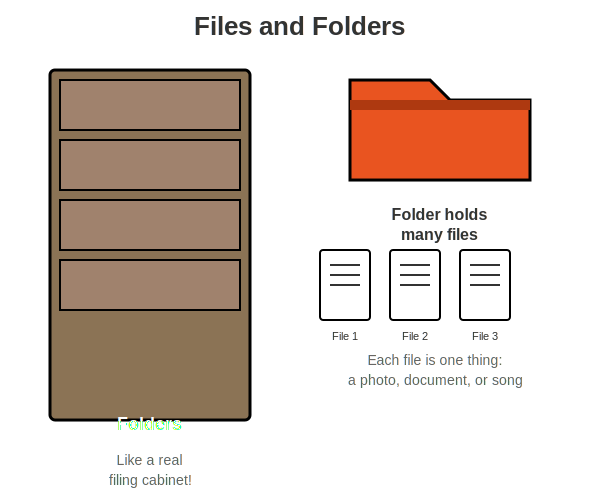

# Chapter 2: Meet Ubuntu

Now that you know what a computer is, let's explore Ubuntu! When you turn on your computer, Ubuntu is what makes everything work.

## Your Desktop: Home Base

![Screenshot Placeholder: Clean Ubuntu desktop]

When Ubuntu starts up, you see your **desktop**. This is like your computer's home base. Let's look at what's on your screen:

**The Top Bar (Panel):**
- Shows the time and date
- Has quick settings (volume, Wi-Fi, power)
- Shows which programs are running
- Lets you search for anything

**The Desktop:**
- The big empty space where you can put files
- You can change the background picture (we'll learn how in Chapter 6!)

**The Dock (Left Side):**
- Shows your favorite programs
- Click an icon to open that program
- Right-click to see more options

**Try This!**

Click on different things in the top bar:
1. Click the time to see a calendar
2. Click the power icon to see battery and settings
3. Click the volume icon to change how loud things are

## The Applications Menu: Finding Programs

![Screenshot Placeholder: Applications menu open]

Click the grid of 9 dots at the bottom-left (it might say "Show Applications"). This opens your **Applications Menu** where all your programs live.

You can:
- Scroll through all the apps
- Type to search for a specific app
- Click any app to open it

**Try This!**

1. Click "Show Applications"
2. Type "calc" and press Enter
3. The Calculator app will open!
4. Try doing some math (what's 123 + 456?)
5. Close the calculator by clicking the X in the top corner

## Files and Folders: Where Your Stuff Lives

![Screenshot Placeholder: Files application]

Your computer organizes everything into **files** and **folders**, just like a real filing cabinet:

- A **file** is one thing: a picture, a document, a song
- A **folder** holds multiple files (and other folders)

Let's open the Files app to explore:

1. Click "Show Applications"
2. Click on "Files" (or type "files")

![Screenshot Placeholder: Files app showing folders]

You'll see several folders:

**Desktop:** Files you put on your desktop
**Documents:** Good for storing papers and reports
**Downloads:** Where files you download from the Internet go
**Music:** For your songs
**Pictures:** For your photos and drawings
**Videos:** For your video files
**Public:** Files you want to share with others

**Try This!**

Let's create your first folder:

1. Open Files
2. Click on "Documents"
3. Right-click in the empty space
4. Choose "New Folder"
5. Name it "My Cool Stuff"
6. Press Enter

![Screenshot Placeholder: Creating a new folder]

Congratulations! You just made your first folder!

## Programs That Come With Ubuntu

Ubuntu comes with lots of useful programs already installed. Let's meet the most important ones:

### Firefox: Your Web Browser

![Screenshot Placeholder: Firefox icon and window]

**Firefox** is how you browse the Internet. We'll learn all about it in Chapter 3!

### Files: Your File Manager

We just used this! It helps you organize all your stuff.

### LibreOffice: Creating Documents

![Screenshot Placeholder: LibreOffice Writer]

**LibreOffice** is like Microsoft Office, but free! It has:
- **Writer:** For writing documents
- **Calc:** For spreadsheets (like Excel)
- **Impress:** For presentations (like PowerPoint)
- **Draw:** For diagrams and flowcharts

We'll use these in Chapter 4 when we create things!

### Rhythmbox: Music Player

![Screenshot Placeholder: Rhythmbox]

Play your music, organize songs into playlists, and listen while you work.

### Videos: Watch Movies

![Screenshot Placeholder: Videos app]

Also called Totem, this is your video player for watching movies and videos.

### GNOME Photos: View Your Pictures

![Screenshot Placeholder: Photos app]

See all your photos in one place, organized by date.

### Text Editor: Simple Writing

![Screenshot Placeholder: Text Editor]

Perfect for quick notes and simple text files.

### Settings: Control Everything

![Screenshot Placeholder: Settings]

This is control central! You can change:
- How your computer looks
- Connect to Wi-Fi
- Adjust volume and brightness
- See information about your computer
- Much more!

## Understanding Your Files

Every file has a few important properties:

**Name:** What the file is called (like "vacation-photo.jpg")

**Type:** What kind of file it is:
- `.txt` = Text file
- `.jpg` or `.png` = Picture
- `.mp3` = Music
- `.mp4` = Video
- `.pdf` = Document that looks the same on all computers
- `.odt` = LibreOffice document

**Size:** How much space it takes up:
- **Bytes (B):** Tiny (a few letters)
- **Kilobytes (KB):** Small (a page of text)
- **Megabytes (MB):** Medium (a photo or song)
- **Gigabytes (GB):** Large (a movie or video game)

**Try This!**

Let's look at a file's properties:

1. Open Files
2. Click on "Documents"
3. Right-click on any file (or create a new folder if it's empty)
4. Choose "Properties"
5. See the file's size, type, and when it was created!

## Working With Windows

When you open a program, it appears in a **window**. Let's learn to control windows:

![Screenshot Placeholder: A window with labels for title bar, minimize, maximize, close]

**Title Bar (Top):**
- Shows the program name
- Grab here to drag the window around

**Three Buttons (Top Right):**
- **Minimize (-):** Hide window temporarily (it goes to the top bar)
- **Maximize (□):** Make window fill the whole screen
- **Close (X):** Quit the program

**Try This!**

Let's practice with windows:

1. Open the Calculator (type "calc" in Applications)
2. Drag the window around by its title bar
3. Click Maximize - it fills the screen!
4. Click Maximize again - it shrinks back
5. Click Minimize - it disappears (look for it in the top bar)
6. Click it in the top bar - it comes back!
7. Click the X to close it

**Pro Tip:** You can also right-click on the title bar for more options!

## The Power Menu: Shutting Down

![Screenshot Placeholder: Power menu]

When you're done using your computer, click the power button in the top-right corner. You'll see options:

- **Suspend:** Computer goes to sleep (uses almost no power, but you can wake it up fast)
- **Restart:** Turn off and turn back on (good when updating)
- **Power Off:** Shut down completely

**Important:** Always use the power menu to shut down. Don't just hold the power button unless the computer is frozen!

## What You Learned

- The **desktop** is your home screen with the top bar, dock, and background
- The **Applications menu** (9 dots) shows all your programs
- **Files and folders** organize everything on your computer
- Ubuntu comes with lots of useful programs already installed
- **Windows** can be moved, resized, minimized, maximized, and closed
- File types are shown by their extension (`.jpg`, `.txt`, etc.)
- Always shut down properly using the power menu

## Challenge Activities

**Easy:**
1. Create three new folders in Documents called "School," "Games," and "Art"
2. Find and open five different programs from the Applications menu

**Medium:**
1. Open three programs at once (Calculator, Files, and Text Editor)
2. Practice minimizing, maximizing, and arranging them
3. Create a text file using Text Editor and save it in your Documents folder

**Hard:**
1. Explore every folder in Files and see what's inside
2. Find a file, look at its properties, and tell someone:
   - Its exact name
   - Its size
   - What type it is
   - When it was created
3. Organize 5 files into appropriate folders (pictures in Pictures, etc.)

---

**What's Next:** You've got the basics down! In Chapter 3, we're going to explore the Internet. You'll learn how to browse the web, stay safe online, and use email.

[← Back to Chapter 1](01-what-is-a-computer.md) | [Continue to Chapter 3 →](03-the-internet.md)
