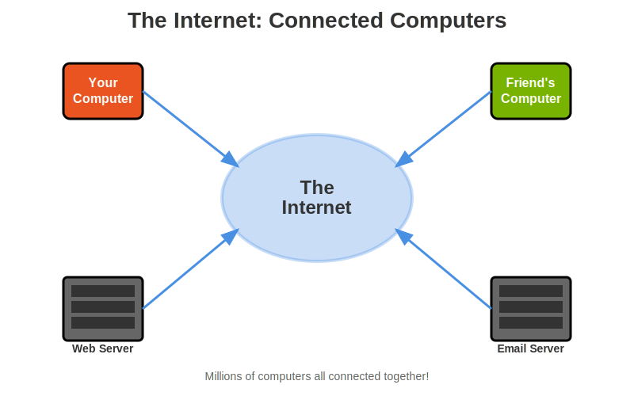
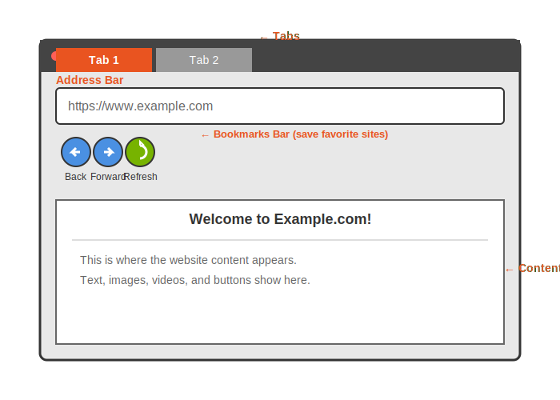

# Chapter 3: The Internet 🌍

The Internet is one of the COOLEST things about having a computer! 🤩 It's like having a magical portal 🌈 to the entire world right at your fingertips! Let's learn how to use it safely and powerfully! 💪

## What Is the Internet? 🌐



The **Internet** is millions of computers all connected together around the world 🌎, sharing information at lightning speed! ⚡ When you go to a website, your computer asks another computer (called a server 🖥️) to send you a web page. It happens in seconds - like magic! ✨

Imagine the Internet like a GIANT library 📚 - but instead of walking around, you can instantly teleport 🌟 to any book you want!

Think of it like this:
- Every website is a book 📖
- Your computer is like you walking into the library 🚶
- Your browser is like your ability to read 👀
- URLs (web addresses) are like call numbers telling you where to find each book 🏷️

Pretty cool, right? 😎

## Meet Firefox: Your Web Browser 🦊🔥

![Screenshot Placeholder: Firefox browser window]

**Firefox** 🦊 is your web browser - your vehicle for cruising the Internet superhighway! 🛣️ It's the program that shows you websites and makes the Internet come alive on your screen! ✨

Let's open it and start exploring:

1. Click "Show Applications" 📱
2. Click the Firefox icon 🦊 (or type "firefox") ⌨️

### Parts of Firefox 🧩



Think of Firefox like the dashboard of a spaceship 🚀 - each button has a special purpose!

**Address Bar:** 📍 Where you type web addresses (URLs) - it's like your GPS!
**Tabs:** 📑 Open multiple websites at once (like having many books open!)
**Back/Forward Buttons:** ⬅️➡️ Time travel through pages you've visited!
**Refresh Button:** 🔄 Reload the current page (get the latest info!)
**Home Button:** 🏠 Zoom back to your starting page!
**Bookmarks:** ⭐ Save your favorite websites (like keeping a treasure map!)
**Menu (Three Lines):** ☰ More options and settings (the secret panel!)

**Try This!** 🎯

Let's visit your first website (adventure time! 🗺️):

1. Click in the address bar 📍
2. Type: `ubuntu.com` ⌨️
3. Press Enter ↩️
4. WHOOSH! 💨 You're now on Ubuntu's official website! 🎉

![Screenshot Placeholder: ubuntu.com loaded]

How fast was that?! You just sent a message across the Internet and got a website back in seconds! 🚀

## How Web Addresses Work 🏠

A **URL** (Uniform Resource Locator) is a web address - like a street address for websites! 📬 Here's how to read one (it's like cracking a secret code! 🕵️):

```
https://www.ubuntu.com/download
│      │   │         │  │
│      │   │         │  └─ The specific page 📄
│      │   │         └──── The website name 🏷️
│      │   └───────────── "www" (world wide web) 🌐
│      └──────────────── The protocol (how computers talk) 📡
└─────────────────────── Secure connection 🔒
```

**Important Parts:** 🔑

- `https://` 🔒 means secure connection (data is encrypted - like a secret code! 🤫)
- `http://` ⚠️ means NOT secure (avoid entering passwords here! Danger zone! ❌)
- `.com` 🏢, `.org` 🏛️, `.net` 🌐, `.edu` 🎓 are top-level domains (different types of websites!)

Think of it like this: if websites were houses 🏠, the URL is the complete address including the street, city, and house number!

**Try This!** 🌟

Visit these safe, awesome websites (exploration time! 🧭):
- `duckduckgo.com` 🦆 - A search engine (your Internet detective tool! 🔍)
- `archive.org` 📚 - The Internet Archive with old websites and books (time machine! ⏰)
- `khanacademy.org` 🎓 - Free learning videos (learn ANYTHING for free! 🎉)

## Searching the Internet 🔍

You don't need to know every website's address! That would be impossible - there are BILLIONS of websites! 🤯 Instead, use a **search engine** to find things! It's like having a super-powered librarian 📚 who knows where EVERYTHING is!

### Using DuckDuckGo 🦆

![Screenshot Placeholder: DuckDuckGo homepage]

DuckDuckGo is a search engine that doesn't track what you search for (it respects your privacy! 🛡️). It's like having a friend who never tells your secrets! 🤐

1. Go to `duckduckgo.com` 🦆
2. Type what you want to find ⌨️
3. Press Enter ↩️
4. Click on any result to visit that website! 🎯

**Search Tips:** 💡 (Become a search ninja! 🥷)

Use **quotes** for exact phrases:
- `"solar system"` 🪐 finds pages with those exact words together (super specific!)

Use **-** to exclude words:
- `jaguar -car` 🐆 finds the animal, not the car brand (filter out stuff you don't want!)

Use **site:** to search one website:
- `site:khanacademy.org fractions` 🔢 finds fraction videos only on Khan Academy (search like a pro! 😎)

**Try This!** 🎨

Search for (the Internet has EVERYTHING! 🌟):
1. Your favorite animal 🦁 (learn cool facts!)
2. "how to draw" plus something you like ✏️ (become an artist!)
3. A recipe for your favorite food 🍕 (cooking adventure! 👨‍🍳)

## Tabs: Multiple Websites at Once 📑

![Screenshot Placeholder: Firefox with multiple tabs]

**Tabs** let you have many websites open at the same time without cluttering your screen! 🎉 It's like having multiple books open on your desk 📚 - you can quickly switch between them without losing your place! Think of tabs as your Internet multitasking superpower! 💪

**To open a new tab:** ➕
- Click the + button next to your current tab 🖱️
- Or press `Ctrl + T` ⌨️ (T = Tab!)

**To close a tab:** ❌
- Click the X on the tab 🖱️
- Or press `Ctrl + W` ⌨️ (W = Window close!)

**To switch between tabs:** ⬅️➡️
- Click on the tab you want 🖱️
- Or press `Ctrl + Tab` ⌨️ (like flipping through pages! 📖)

**Try This!** 🎯

1. Open three tabs ➕➕➕
2. Go to a different website in each tab 🌐
3. Practice switching between them ⬅️➡️ (tab juggling! 🤹)
4. Close one tab ❌ (see how easy that was?)

## Bookmarks: Saving Your Favorites ⭐

When you find a website you LOVE, **bookmark** it so you can find it again easily! 🎉 It's like putting a bookmark 📖 in your favorite chapter - but for the Internet! Think of it as building your own personal collection of awesome websites! ✨

![Screenshot Placeholder: Bookmarks menu]

**To bookmark a page:** 🔖
1. While on the page you like 💖, click the menu (three lines) ☰
2. Choose "Bookmark Page" ⭐
3. Or press `Ctrl + D` ⌨️ (D = Don't forget this page!)

**To see your bookmarks:** 📚
1. Click the menu ☰
2. Choose "Bookmarks" ⭐
3. Click on any bookmark to visit that site! 🚀 (instant teleportation!)

**Try This!** 🎯

1. Find a website you like 💖 (something cool!)
2. Bookmark it ⭐ (save it for later!)
3. Close the tab ❌ (it's gone... or is it? 🤔)
4. Open your bookmarks 📚 and click it to go back! ✨ (magic! You found it again!)

## Staying Safe Online 🛡️

The Internet is AMAZING 🌟, but just like the real world, you need to know how to stay safe! Think of these rules as your Internet safety superpowers! 💪🦸

### The Rules of Internet Safety 📜

**1. Never Share Personal Information** 🚫🔒

Don't tell strangers online (and remember: if you haven't met someone in real life, they're a stranger! 👤):
- Your full name 📛, address 🏠, or phone number 📱 (keep it secret!)
- Your school's name 🎓 (nobody's business!)
- Where you hang out 🎮 (stay mysterious!)
- When you'll be home alone 🏡 (safety first!)

**2. Ask Before Creating Accounts** 🙋

Many websites want you to create an account. Always ask a parent first! 👨👩 It's like needing permission to join a club - your parents need to know! Here's why:
- You need to provide an email address 📧
- You have to agree to terms of service (rules) 📜
- Sometimes sites ask for payment information 💳 (definitely need permission for that!)

**3. Tell an Adult About Weird Stuff** 🚨

If you see ANYTHING that makes you uncomfortable, it's NOT tattling - it's being smart! 🧠 Tell a trusted adult immediately if you see:
- Mean comments or bullying 😠 (not cool!)
- Scary or inappropriate content 👻 (you shouldn't see that!)
- Someone asking to meet in person 🚫 (MAJOR red flag! 🚩)
- Requests for personal information 📋 (suspicious!)

→ Tell a trusted adult immediately! They're here to help! 💚

**4. Use Strong Passwords** 🔐

If you have accounts, use STRONG passwords! 💪 Think of passwords as the locks 🔒 on your digital doors!
- At least 10 characters long 📏 (the longer, the better!)
- Mix letters, numbers, and symbols 🔤🔢#@! (make it tricky!)
- Don't use your name or birthday 🎂 (too easy to guess!)
- Don't use the same password everywhere 🔑 (if one lock breaks, they're not all broken!)

**Pro Tip:** 💡 Make your password a sentence you can remember like "ILove2EatPizza!" 🍕

**5. Think Before You Click** 🤔

Some links and downloads can be harmful 😈. Be a smart clicker! Here's the rule: When in doubt, don't click! 🚫
- Don't click suspicious links 🔗 (trust your gut!)
- Don't download things without permission 📥 (ask first!)
- Don't click on ads that seem too good to be true 🎁 ("FREE PS5!" = probably a trap! 🪤)
- If it seems weird, don't click it! ⚠️

**6. Remember: The Internet Is Forever** ♾️

This is SUPER important! 🚨 Anything you post online might stay there FOREVER - like, seriously, FOREVER! Before sharing a photo 📸, video 🎥, or comment 💬, ask yourself: "Would I be okay with EVERYONE seeing this? My parents? My teachers? Future me?" 🤔

If the answer is no, DON'T POST IT! ❌

### Spotting Fake Websites 🕵️

Sometimes bad people create fake websites to trick you (they're like Internet pirates! 🏴‍☠️). But you can be a website detective! 🔍 Here are the warning signs:

❌ **DANGER SIGNS:**
- The URL looks weird 😵 (like `g00gle.com` instead of `google.com` - spot the zeros? That's fake!)
- The website asks for passwords or credit cards right away 💳 (too pushy! Suspicious!)
- Lots of pop-ups and flashing ads 💥 (annoying AND dangerous!)
- The address bar doesn't show `https://` 🔒 (no secure connection = no trust!)
- Too many spelling mistakes 📝 (real companies proofread!)

✅ **REAL websites look like this:**
- Have proper URLs 🏷️ (spelled correctly!)
- Look professional 💼 (clean, organized, nice design)
- Don't bombard you with pop-ups 🚫 (respectful!)
- Use `https://` 🔒 (look for the padlock icon - that's your security badge!)

Think of it like this: Real websites are like real stores 🏪 - clean, organized, and professional. Fake websites are like shady back alleys 🌑 - messy, suspicious, and scary!

## Using Email Basics 📧

**Email** (electronic mail! ✉️) lets you send messages to other people over the Internet! It's like having a digital mailbox 📬 that works instantly! Each person has an email address that looks like this:

```
username@example.com
│        │ │
│        │ └─ The email service 🏢
│        └─── The @ symbol ("at")
└───────────── The person's username 🏷️
```

So you say it like: "username AT example DOT com" 📢

### Common Email Services 📮

- Gmail 📧 (by Google)
- Outlook/Hotmail 💌 (by Microsoft)
- ProtonMail 🔒 (very private - super secure!)
- Yahoo Mail 📬

You access email through a web browser 🌐 (go to gmail.com, for example) or through an email app 📱. It's like checking your mailbox, but from your computer! 💻

**Email Safety:** 🛡️ (Super important! Pay attention! 🚨)

- Don't open emails from people you don't know 👤❌ (stranger danger applies online too!)
- Don't click links in suspicious emails 🔗⚠️ (they might be traps!)
- Don't reply to spam (junk email) 🗑️ (just delete it!)
- If an email seems too good to be true, it probably is! 🎁❌ ("You won a million dollars!" = FAKE!)
- Never share your email password 🔐 with anyone except your parents (not even friends!)

## Downloading Files 📥

Sometimes you'll want to **download** things from the Internet - save a file from the web to your computer! 💾 It's like taking something home from a store, but digitally! ✨

**Safe things to download:** ✅

- Pictures from trusted websites 🖼️ (wallpapers, photos for projects)
- Documents from school or teachers 📚 (homework, study guides)
- Open-source software from official websites 💻 (games, learning apps - but ask first!)
- Free educational resources 🎓 (PDF books, worksheets)

**Be careful with:** ⚠️ (Danger zone! Ask an adult first!)

- Programs and apps 🎮 (they can have hidden bad stuff!)
- Files from unknown websites 🌐❓ (sketchy!)
- Email attachments from strangers 📎👤 (could be viruses! 🦠)
- Anything that promises free money 💰, games 🎮, or prizes 🎁 (if it's too good to be true, it's a SCAM! 🚨)

**Where downloads go:** 📂

By default, files you download go to your **Downloads** folder! Think of it as your computer's delivery box! 📦 To find your stuff:

1. Open Files 📂
2. Click "Downloads" ⬇️ in the sidebar
3. Your downloaded files are there! 🎉 (like opening presents!)

![Screenshot Placeholder: Downloads folder]

## What You Learned 📝

Look at you! You're an Internet expert now! 🌟 Here's what you mastered:

- The **Internet** 🌍 connects millions of computers worldwide (you're part of this massive network!)
- **Firefox** 🦊 is your web browser for viewing websites (your spaceship for Internet exploration!)
- **URLs** 🏷️ are web addresses that take you to different sites (like coordinates on a map!)
- **Search engines** 🔍 like DuckDuckGo help you find ANYTHING (your Internet detective tool!)
- **Tabs** 📑 let you open multiple websites at once (multitasking master!)
- **Bookmarks** ⭐ save your favorite sites for easy access (your personal treasure map!)
- **Stay safe** 🛡️ by not sharing personal info and asking adults for help (Internet safety superhero!)
- **Email** 📧 lets you send messages to other people (instant digital mail!)
- **Downloads** 📥 are saved to your Downloads folder (your delivery box!)

## Challenge Activities 🏆

**Easy:** 🟢 (Internet Explorer level! 🧭)
1. Visit three new websites 🌐 you've never seen before (discovery time!)
2. Bookmark your two favorites ⭐ (save the best!)
3. Open 5 tabs 📑 and practice switching between them (tab master training! 🥷)

**Medium:** 🟡 (Internet Ninja level! 🥋)
1. Search for "how to draw [your favorite thing]" 🎨 and find a tutorial (learn something new!)
2. Create a new folder called "Cool Websites" 📁 in Documents (organization time!)
3. Write in Text Editor 📝 the URLs of your 5 favorite websites (make your own bookmark list!)
4. Practice using keyboard shortcuts ⌨️: Ctrl+T, Ctrl+W, Ctrl+L (speed demon! ⚡)

**Hard:** 🔴 (Internet Wizard level! 🧙‍♂️)
1. Find three websites 🌐 about something you're learning in school 🎓 (research pro!)
2. Bookmark them in a new bookmark folder 📚 (super organized!)
3. Search for videos or tutorials 🎥 about a skill you want to learn (future you will thank you!)
4. Make a list 📋 of safe, kid-friendly websites you discovered (become a resource expert!)
5. Teach someone in your family 👨👩 one internet safety rule 🛡️ (spread the knowledge! Share your superpower!)

---

**What's Next:** 🚀 You know how to browse the Internet like a pro! 😎 But wait - the REAL fun starts when you CREATE your own stuff! 🎨 In Chapter 4, we'll learn how to make videos 🎬, music 🎵, art 🖼️, and documents 📄. Get ready to become a digital creator! ✨ You're going to make AMAZING things! 🌟

[← Back to Chapter 2](02-meet-ubuntu.md) | [Continue to Chapter 4 →](04-creating-things.md)
