# Chapter 4: Creating Things 🎨✨

This is where the REAL magic happens! ✨🪄 Your computer isn't just for watching and playing - it's for MAKING! Let's unleash your creative superpowers and create awesome stuff! 🚀

## Why Creating Is More Fun Than Consuming 🎭

Think about it:

On a tablet 📱, you watch videos. On your computer 💻, you **MAKE** them! 🎬

On a console 🎮, you play games. On your computer 💻, you **CREATE** them! 👾

On a phone 📱, you scroll through pictures. On your computer 💻, you **DRAW** them! 🖼️

Creators have WAY more fun than consumers! 🎉 Plus, when you make something amazing, you can share it with others and feel SUPER proud! 😊 There's nothing like the feeling of saying "I MADE THAT!" 🌟

## Writing: LibreOffice Writer 📝✍️

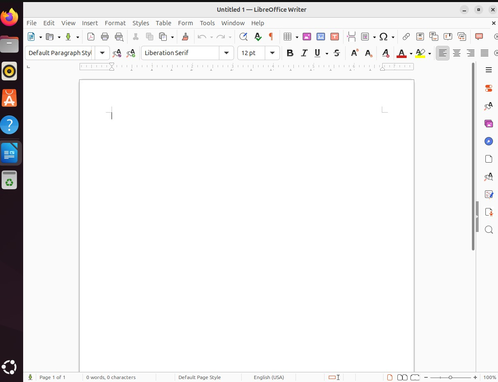

**LibreOffice Writer** is like Microsoft Word, but FREE! 💰 You can write stories 📖, reports 📄, letters 💌, and more! It's your digital typewriter on steroids! 💪

### Your First Document 📄

Let's write something amazing! (Author mode activated! ✨):

1. Click "Show Applications" 📱
2. Type "writer" ⌨️ and open LibreOffice Writer
3. Start typing! 🎯 (Your cursor is blinking - it's waiting for your brilliance!)

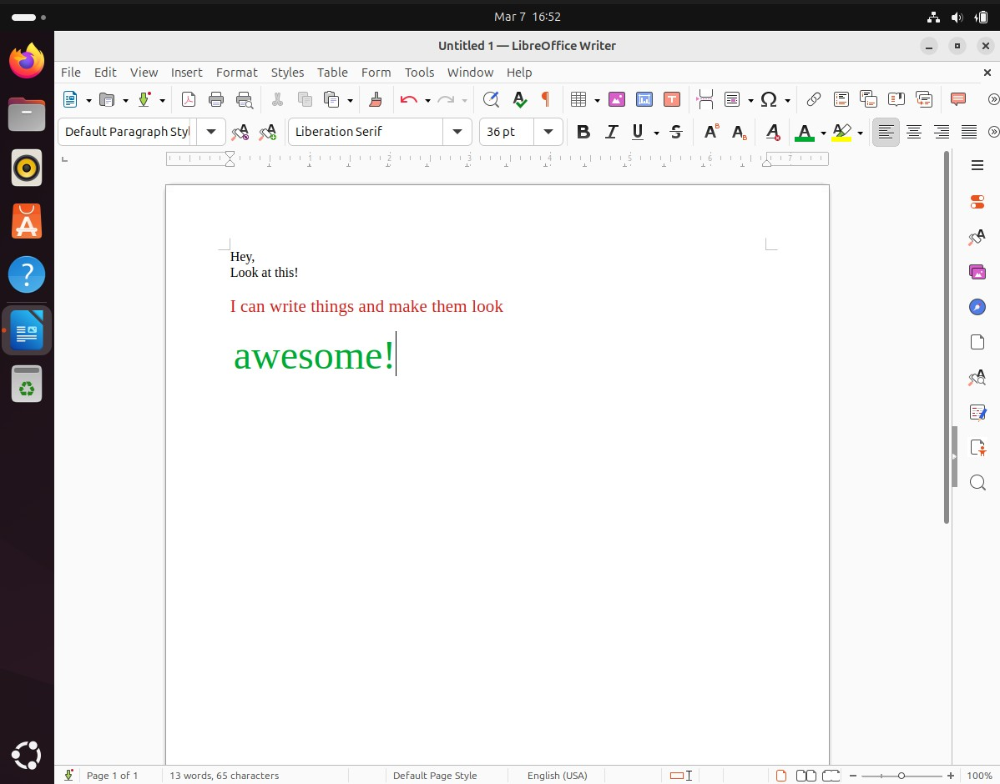

**Cool Things You Can Do:** 🎨 (Text transformation powers! 💫)

**Make text bold:** 💪 Select text and press `Ctrl + B` (BOOM! Emphasis!)
**Make text italic:** *️⃣ Select text and press `Ctrl + I` (fancy! 💃)
**Change font size:** 📏 Use the size dropdown in the toolbar (BIG or small!)
**Change colors:** 🌈 Use the font color button (rainbow text! ✨)
**Add pictures:** 🖼️ Insert > Image (make it visual!)

**Try This!** 📖✨

Write a short story (5-10 sentences) about (unleash your imagination! 🌟):
- Your favorite animal 🦁 going on an adventure 🗺️ (what happens?)
- A day when you got superpowers 💥 (which power would you choose?)
- Finding a magic door 🚪✨ in your house (where does it lead?)

Make your title big and bold! 📣 Change some words to different colors! 🌈 Add a picture if you want! 🖼️ Make it YOURS! 🎨

**Saving Your Work:** 💾

**SUPER IMPORTANT:** ⚠️ Always save your work! (Don't let your masterpiece disappear! 😱)

1. Click File > Save 💾 (or press `Ctrl + S` - S for SAVE!)
2. Choose where to save it 📁 (Documents folder is a great choice!)
3. Give it a cool name 🏷️ (be creative!)
4. Click Save ✅ (DONE!)

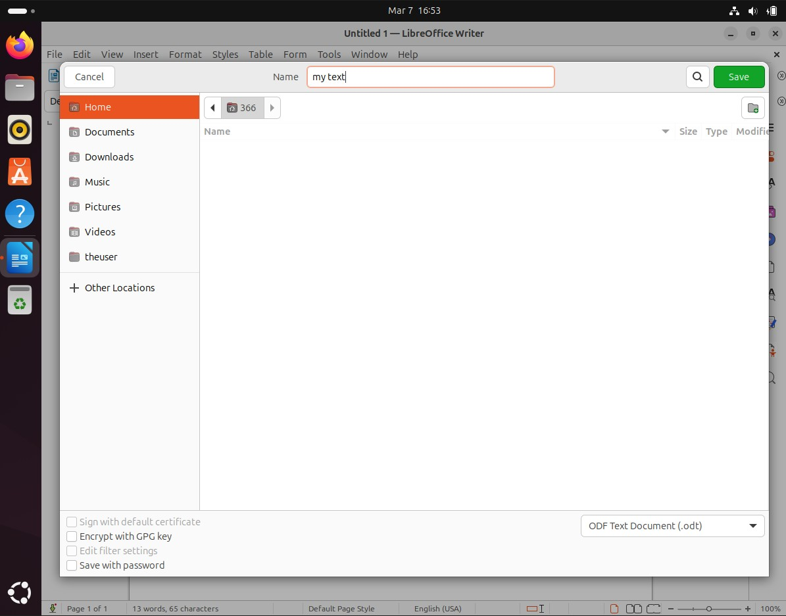

**Pro Tip:** 💡 Save often! Press `Ctrl + S` every few minutes so you don't lose your brilliant work! 🛡️ Think of it like this: saving is like putting your work in a safe 🔒 - do it all the time!

### Making It Look Professional 💼✨

Want your document to look FANCY? 🎩 Like a real published book? Here's how:

**Title Page:** 📄 (Make it POP! 💥)
1. Type your title ⌨️
2. Select it 🖱️
3. Make it BIG 📏 (size 24 or 36 - HUGE!)
4. Make it bold 💪 (`Ctrl + B`)
5. Center it 🎯 (`Ctrl + E` - E for Equal spacing!)

**Paragraph Spacing:** 📐 (Give your words room to breathe! 🌬️)
- Press Enter once ↩️ to start a new paragraph
- Press Enter twice ↩️↩️ to add extra space (breathing room!)

**Lists:** 📝 (Organize like a pro! 🎯)
- Click the bullet point • or numbering 1️⃣2️⃣3️⃣ buttons in the toolbar
- Type your first item ⌨️ and press Enter ↩️
- It automatically makes the next bullet! 🪄 (Magic!)

**Try This!** 🎯

Create a "Top 10" list of your favorite things (ranking time! 🏆):
- Movies 🎬 (what's #1?)
- Books 📚 (page turners!)
- Games 🎮 (high scores!)
- Foods 🍕 (yummm!)
- Whatever you like! ⭐

Make it look AMAZING with a title, colors 🌈, and good formatting! Show off your favorites in style! 😎

## Drawing and Art: GIMP and Drawing Apps 🎨🖌️

Ubuntu has several apps for creating art! 🖼️ Time to become a digital artist! 👨‍🎨

### Drawing App (for Quick Sketches) ✏️

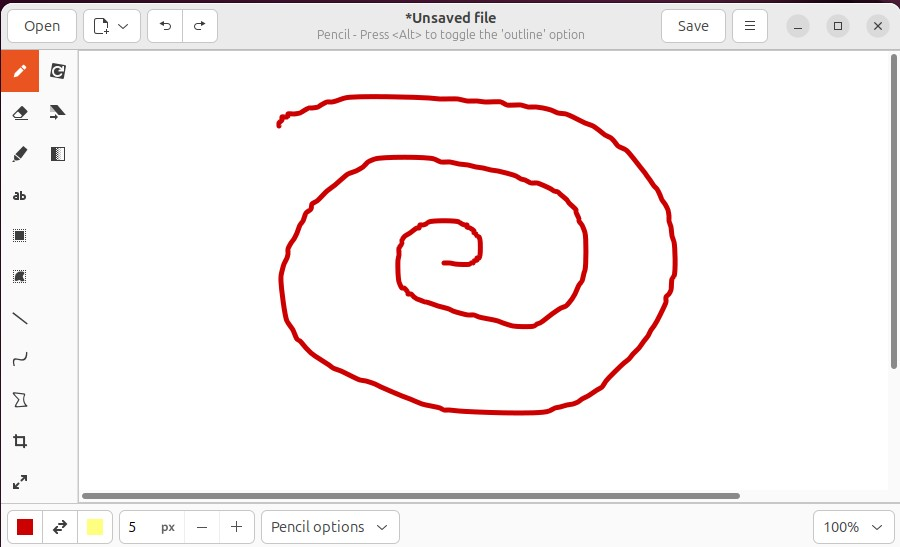

1. Open "Show Applications" 📱
2. Search for "Drawing" 🔍
3. Use the tools to draw! 🎨 (Your canvas awaits!)

Tools you'll find (your art arsenal! 🛠️):
- **Pencil:** ✏️ Freehand drawing (doodle time!)
- **Shapes:** ⭕🔲🔺 Circles, rectangles, triangles (geometry art!)
- **Fill Bucket:** 🪣 Fill an area with color (splash! 💦)
- **Text:** 📝 Add words (label your masterpiece!)
- **Eraser:** 🧹 Fix mistakes (nobody's perfect!)

**Try This!** 🎯

Draw a picture of (artist mode ON! 🎨):
- Your house 🏠 (home sweet home!)
- Your favorite character 🦸 (who do you love?)
- An alien 👽 (from outer space! 🛸)
- Whatever you imagine! 🌟 (the sky's the limit!)

### GIMP (for Advanced Art) 🎨🔥

GIMP is a POWERFUL image editor! 💪 It's like Photoshop but FREE! 💰 (Professional art tool alert! 🚨)

**Note:** 📌 GIMP is more advanced - it's like leveling up from crayons to an artist's studio! 🎨 We'll keep it simple for now, but it can do AMAZING things when you learn more! Think of it as your future superpower! 🦸

**Simple GIMP Project:** 🖼️

1. Open GIMP 🎨
2. File > New 📄 (create a fresh canvas!)
3. Use the paintbrush tool 🖌️ to draw (paint away!)
4. Use the text tool 📝 to add words (label it!)
5. File > Export As 💾 to save your creation (preserve your art!)

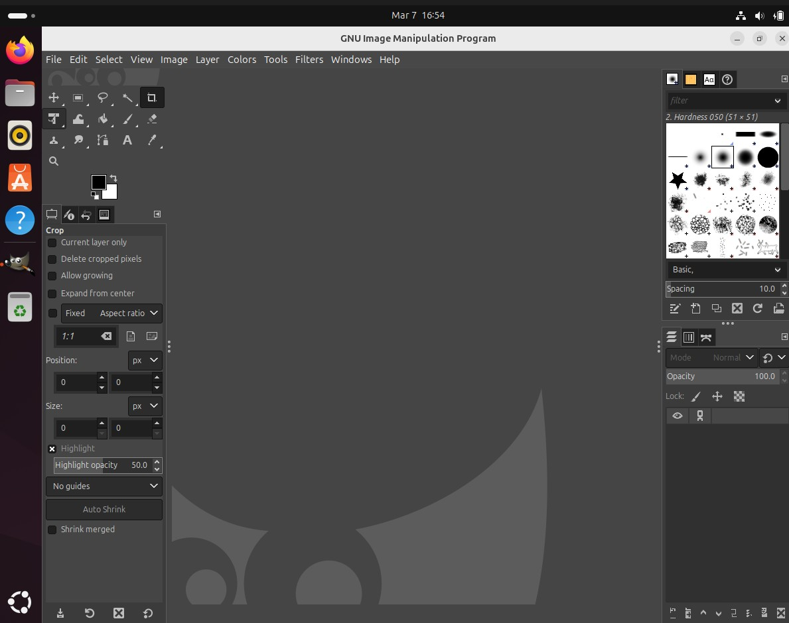

**Pro Tip:** 💡 GIMP can also edit photos! 📸 Photo magic powers! ✨ You can:
- Remove red-eye 👁️❌ (no more demon eyes! 😈➡️😊)
- Adjust brightness 💡 and colors 🌈 (make it pop!)
- Crop images ✂️ (cut out the good stuff!)
- Add cool effects 🎭 (filters galore! Vintage? Dramatic? YOU choose!)

## Making Videos: OpenShot 🎬🎥

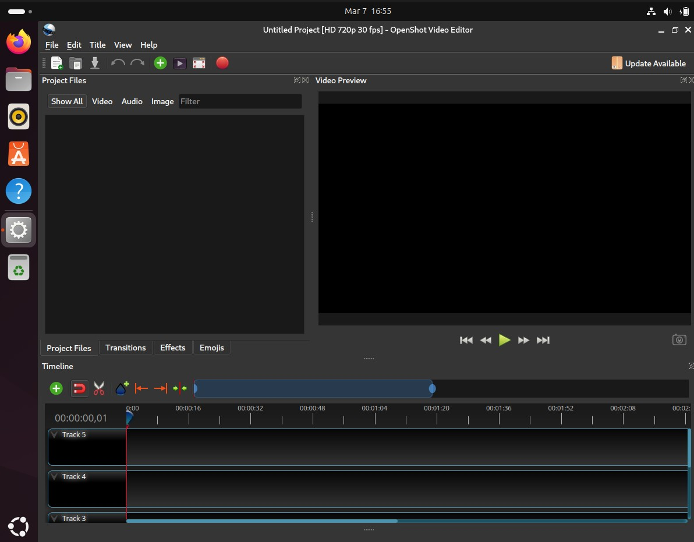

Want to make videos like YouTubers? 📺 **OpenShot** is a video editor that comes with Ubuntu! You're about to become a filmmaker! 🎥 Lights, camera, ACTION! 🎬

### Video Editing Basics 📹

A video is made of (the secret ingredients! 🎭):
- **Video clips:** 🎞️ The actual footage (your scenes!)
- **Audio:** 🎵 Sound and music (the soundtrack of your life!)
- **Titles:** 📝 Text that appears on screen (tell your story!)
- **Transitions:** ✨ How one clip changes to another (smooth moves!)

### Your First Video 🌟

**Before you start,** 📋 you'll need some video clips. You can:
- Record videos with a webcam 📷 (lights on!)
- Use the camera on a phone 📱 and transfer the files (modern filmmaking!)
- Download free video clips from sites like Pexels or Pixabay 🌐 (free resources!)
- Take screenshots 📸 and make a slideshow (creative thinking! 🧠)

**Let's make a simple video:** 🎬 (Director's chair time! 🎭)

1. Open OpenShot 🎥
2. Drag your video clips 🎞️ onto the timeline (like puzzle pieces!)
3. Drag them in order 1️⃣2️⃣3️⃣ (tell your story!)
4. Click Play ▶️ to watch (preview time!)
5. File > Export Video 💾 to save (make it permanent!)

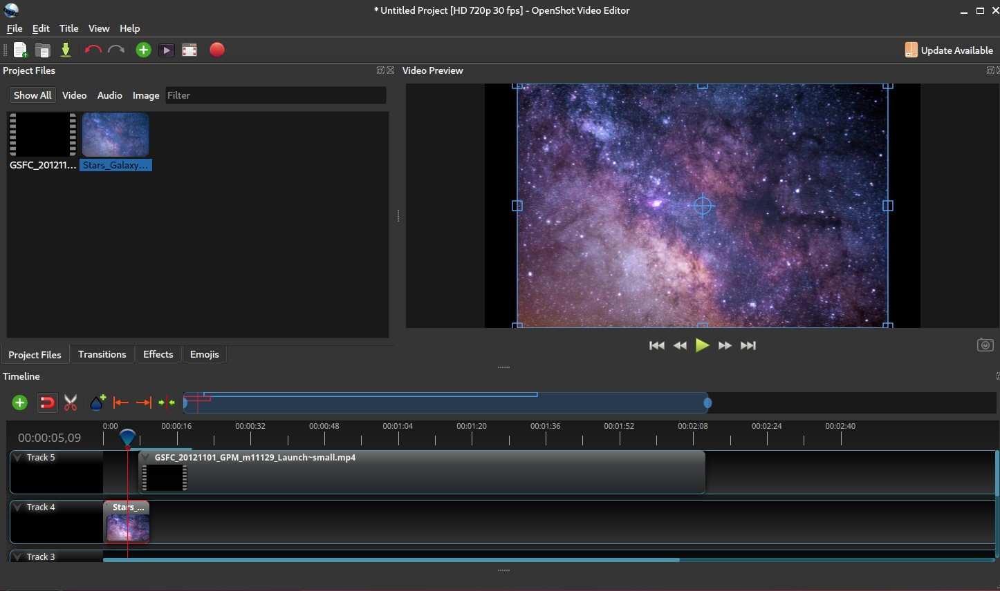

**Adding Cool Stuff:** ✨ (Level up your video! 🚀)

**Titles:** 📝
- Title > Title to add text ✍️
- Type your text ⌨️ (what do you want to say?)
- Drag it onto the timeline 🎯 (place it perfectly!)

**Transitions:** 🌊
- Drag a transition between two clips 🔀
- It makes them blend together smoothly! ✨ (fade, dissolve, zoom - so cool!)

**Audio:** 🎵
- Drag music files 🎶 onto the audio track (add atmosphere!)
- Adjust the volume 🔊 with the clip properties (perfect mix!)

**Try This!** 🎯

Make a 30-second video about your day (mini-movie time! 🎬):
- Film or find 3-5 short clips 📹 (capture moments!)
- Add them to OpenShot in order 🎞️ (sequence it!)
- Add a title at the beginning 📝 ("My Day" or get creative!)
- Add music if you want 🎵 (set the mood!)
- Export and watch your creation! 🎉 (YOU'RE A FILMMAKER NOW! 🌟)

## Recording Audio: Audacity 🎙️🎵

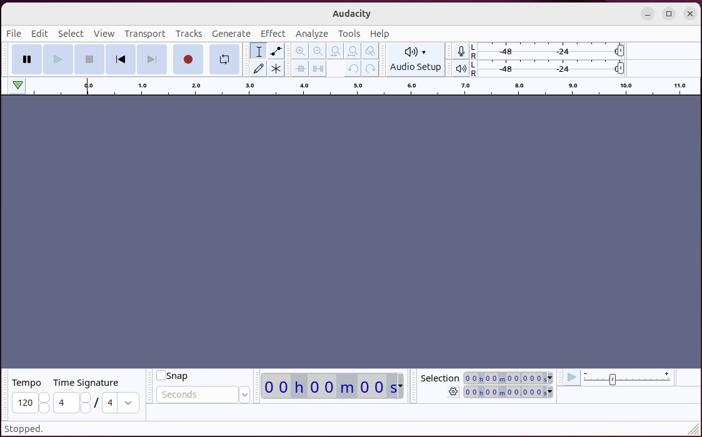

**Audacity** lets you record and edit audio! 🎧 Make podcasts 📻, record songs 🎤, or create sound effects! 🔊 You're about to become an audio producer! 🎵

**You might need to install Audacity first** 📥 (we'll learn how in Chapter 5). For now, Ubuntu has a simple recorder (perfect for beginners! 🌟):

1. Search for "Sound Recorder" 🔍
2. Click Record 🔴 (GO!)
3. Talk, sing 🎤, or make sounds! 🗣️ (let your voice be heard!)
4. Click Stop ⏹️ (that's a wrap!)
5. Your recording is saved! 💾 (preserved forever!)

![Screenshot Placeholder: Sound Recorder]

**Try This!** 🎯

Record yourself (audio adventure! 🎙️):
- Telling a joke 😂 (make people laugh!)
- Singing part of a song 🎵 (show off those vocals!)
- Reading your favorite book passage 📖 (audiobook time!)
- Making funny sound effects 🎭 (BOOM! CRASH! WHOOSH! 💥)

## Making Presentations: LibreOffice Impress 🎤📊

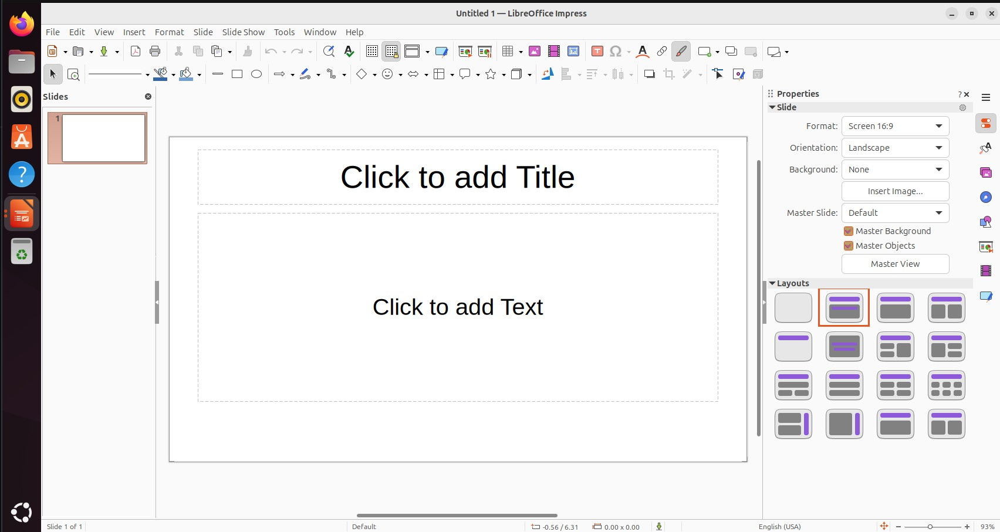

**Impress** is for making presentations (like PowerPoint)! 🎭 Perfect for school projects! It's like creating your own TV show! 📺 You're the presenter! 🌟

### Creating Your First Slideshow 🎬

1. Open "Show Applications" 📱
2. Type "impress" ⌨️ and open it
3. Choose a template 🎨 or start with a blank presentation (your stage awaits! 🎪)

**A presentation has:** 📋 (The building blocks! 🧱)
- **Slides:** 📄 Individual pages (like a comic book!)
- **Titles:** 📣 Main heading on each slide (grab attention!)
- **Text:** 📝 Information you want to share (tell your story!)
- **Images:** 🖼️ Pictures that support your ideas (show, don't just tell!)
- **Transitions:** ✨ How slides change (swoosh! 💫)

**Making It Good:** 💯 (Presentation pro tips! 🎯)

- **Keep it simple:** 🎯 Don't put too much on one slide (less is more!)
- **Use pictures:** 📸 Images are more interesting than text (visual power! 👀)
- **Big text:** 📏 Make sure people can read it (no squinting! 👓)
- **Practice:** 🎭 Know what you'll say for each slide (confidence is key! 💪)

**Try This!** 🎯

Make a 5-slide presentation about (show and tell time! 🎪):
- Your favorite hobby 🎨 (what do you love?)
- A cool animal 🦁 (teach us something!)
- A place you'd like to visit ✈️ (dream destination!)
- Something you learned recently 🧠 (share your knowledge!)

Include (checklist! ✅):
- A title slide 📣 (strong opening!)
- At least 3 pictures 🖼️ (visual appeal!)
- Simple bullet points 📝 (clear and concise!)
- A conclusion slide 🎬 (strong ending!)

## Spreadsheets: LibreOffice Calc 📊🔢

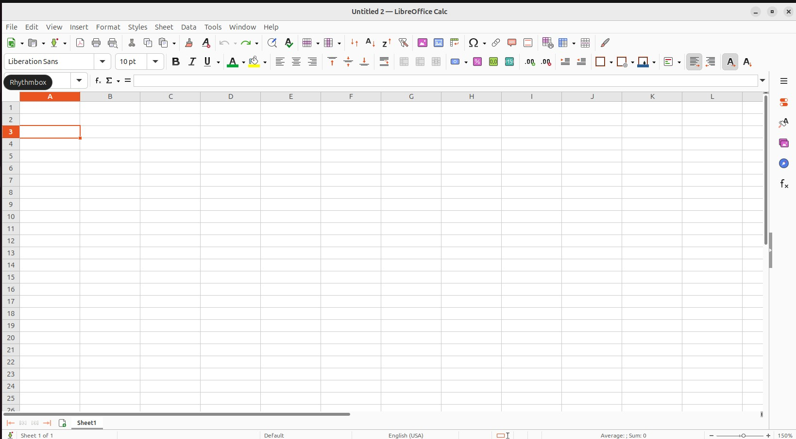

**Calc** is for spreadsheets! 📈 It's like a super-powered calculator 🧮 that can organize data in rows and columns! Think of it as your digital organization superhero! 🦸

**What are spreadsheets good for?** 🤔 (SO many things! ✨)
- Keeping track of scores 🎮 (high score champion!)
- Making lists 📝 (organize EVERYTHING!)
- Doing lots of math at once 🔢 (math wizard! 🧙‍♂️)
- Creating charts and graphs 📊 (visualize your data!)
- Organizing collections 🎴 (like game stats or card collections!)

**Basic Spreadsheet Skills:** 📋 (Grid master mode! 🎯)

**Cells:** 📦 Each box is a cell (like A1, B2, C3 - addresses for data!)
**Rows:** ➡️ Go across (numbered 1, 2, 3... horizontal!)
**Columns:** ⬇️ Go up and down (lettered A, B, C... vertical!)

**Try This - Make a Game Score Tracker:** 🎮 (Track your victories! 🏆)

1. Open Calc 📊
2. In cell A1, type "Game" 🎮
3. In cell B1, type "Score" 🔢
4. In cell C1, type "Date" 📅
5. Fill in your favorite games and high scores! ⭐ (Brag about your skills!)

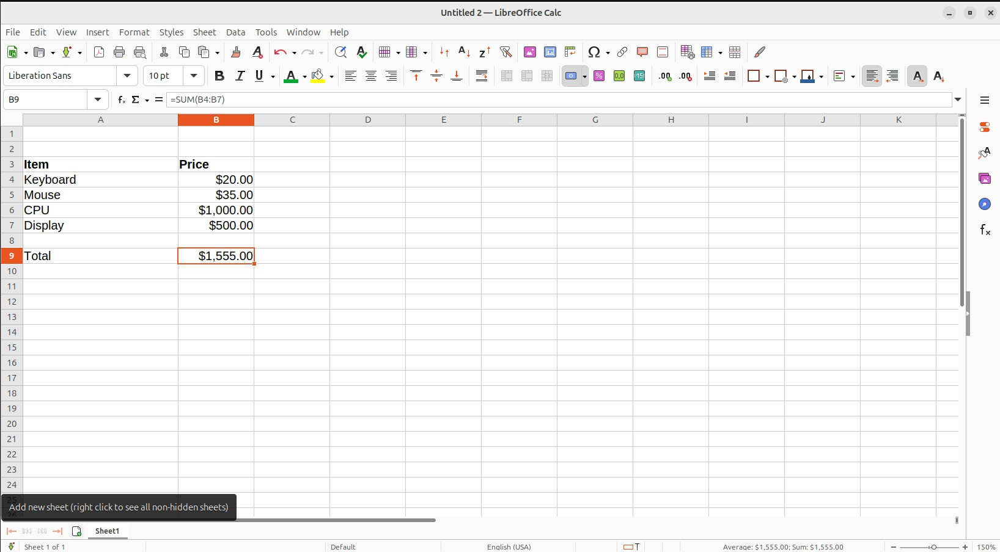

**Cool Calc Trick - Automatic Math:** ✨ (Calculator magic! 🪄)

Type `=5+3` in a cell and press Enter. It calculates it for you! 🤯 (MIND BLOWN!)

You can use:
- `+` ➕ for addition (put numbers together!)
- `-` ➖ for subtraction (take away!)
- `*` ✖️ for multiplication (times!)
- `/` ➗ for division (split it up!)

Want to add up a column? 📈 Type `=SUM(A1:A10)` to add cells A1 through A10! It's like having a robot do your math homework! 🤖 (Legal and awesome!)

## Where Your Creations Go 📁✨

**Important:** 🚨 Save everything in organized folders! Think of your computer like your room - you wouldn't throw everything on the floor, right? 🤔 Organization is your superpower! 💪

Create folders like (your digital filing system! 🗂️):
- **My Stories** 📖 (for Writer documents - future bestsellers!)
- **My Art** 🎨 (for drawings - your gallery!)
- **My Videos** 🎬 (for video projects - your film studio!)
- **My Music** 🎵 (for audio recordings - your sound booth!)
- **School Projects** 🎓 (for homework - stay organized!)

This makes finding your stuff SUPER easy! 🎯 No more "where did I save that?" moments! 😅

**Pro Tip:** 💡 Name your files clearly (future you will thank you! 🙏):
- Good: ✅ `story-about-dragons-2026.odt` (descriptive! You know exactly what it is!)
- Bad: ❌ `untitled1.odt` (what is this? A mystery box? 📦❓)

## Sharing Your Creations 🎁🌟

Once you make something cool, you might want to share it! 🤩 Show off your talents! Time to let the world see your awesome work! 🌍

**Ways to share:** 📤 (Spread the creativity! ✨)

**1. Export as PDF** 📄 (for documents and presentations - the universal format!)
- Works on any computer 💻 (Windows, Mac, Linux - everywhere!)
- Can't be accidentally edited 🔒 (your masterpiece stays perfect!)
- Easy to email 📧 or print 🖨️ (versatile!)

**2. Copy to a USB drive** 💾 (the physical transfer! 🚚)
- Plug in a USB drive 🔌 (the little stick!)
- Copy your file to it 📋 (drag and drop!)
- Give it to someone or use it on another computer! 🎁 (sneakernet mode!)

**3. Email it** 📧 (if you have email - digital delivery!)
- Attach the file 📎 to an email (click attach!)
- Send it to family or friends 👨👩 (instant sharing!)

**4. Upload to cloud storage** ☁️ (with parent permission - cloud power!)
- Services like Dropbox, Google Drive 🌐 (the Internet's storage!)
- Can share a link 🔗 with others (easy access!)

## What You Learned 📝🌟

Look at you! You're a CREATOR now! 🎨✨ Here's your creative arsenal:

- **LibreOffice Writer** 📝 for writing documents, stories, and reports (word wizard! 🧙‍♂️)
- **Drawing and GIMP** 🎨 for creating artwork and editing images (digital artist! 👨‍🎨)
- **OpenShot** 🎬 for making and editing videos (filmmaker extraordinaire! 🎥)
- **Sound Recorder and Audacity** 🎙️ for recording audio (audio producer! 🎵)
- **LibreOffice Impress** 📊 for creating presentations (presenter pro! 🎤)
- **LibreOffice Calc** 🔢 for spreadsheets and organizing data (data master! 📈)
- How to save 💾 and organize your creations 📁 (organization ninja! 🥷)
- Ways to share 🎁 what you make (spread the creativity! 🌟)

You've unlocked ALL the creative tools! 🎉 You can now make ANYTHING! 🚀

## Challenge Activities 🏆

**Easy:** 🟢 (Beginner Creator level! 🌱)
1. Write a one-page story 📖 and format it nicely (make it pretty!)
2. Draw a picture 🎨 and save it (digital art debut!)
3. Record yourself saying something funny 🎤 (comedy gold! 😂)

**Medium:** 🟡 (Creative Ninja level! 🥋)
1. Create a video 🎬 with at least 3 clips and a title (mini movie!)
2. Make a presentation 📊 about your favorite topic (5+ slides - teach us!)
3. Design a poster 🖼️ for an imaginary event (get creative!)

**Hard:** 🔴 (Master Creator level! 🌟)
1. Make a complete video 🎥 with clips, music 🎵, titles, and transitions ✨ (Hollywood quality!)
2. Create a comic strip 📰 using Drawing or GIMP (tell a story in pictures!)
3. Write and format a full short story 📚 (3+ pages) with a title page (author mode!)
4. Make a spreadsheet 📊 that tracks something you care about (data pro!)
5. Record a podcast episode 🎙️ (5 minutes) about something you love (broadcasting!)

**Expert Challenge:** 💎 (LEGEND MODE! 🏆✨)

Pick a project and make something to share with your class or family (show off time! 🌟):
- A video about your hobby 🎬 (teach the world!)
- A presentation teaching something you know 🎓 (share your expertise!)
- An illustrated story 📖🎨 (combine writing and art!)
- A digital art piece 🖼️ (museum-worthy!)
- A podcast episode 🎙️ (become a host!)

The goal is to CREATE something that's uniquely YOURS! 💫 Something that didn't exist before YOU made it! That's the real magic! ✨ Be proud of what you create! 🎉

---

**What's Next:** 🚀 You've created AMAZING things with the programs that come with Ubuntu! 🎨✨ But what if you want MORE programs? 🤔 Even MORE creative tools? Even MORE possibilities? 💫 In Chapter 5, we'll learn how to install new software 📦 and build your perfect toolkit! Get ready to level up your computer! 🆙🎮

[← Back to Chapter 3](03-the-internet.md) | [Continue to Chapter 5 →](05-installing-software.md)
