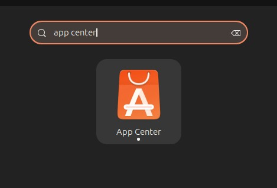
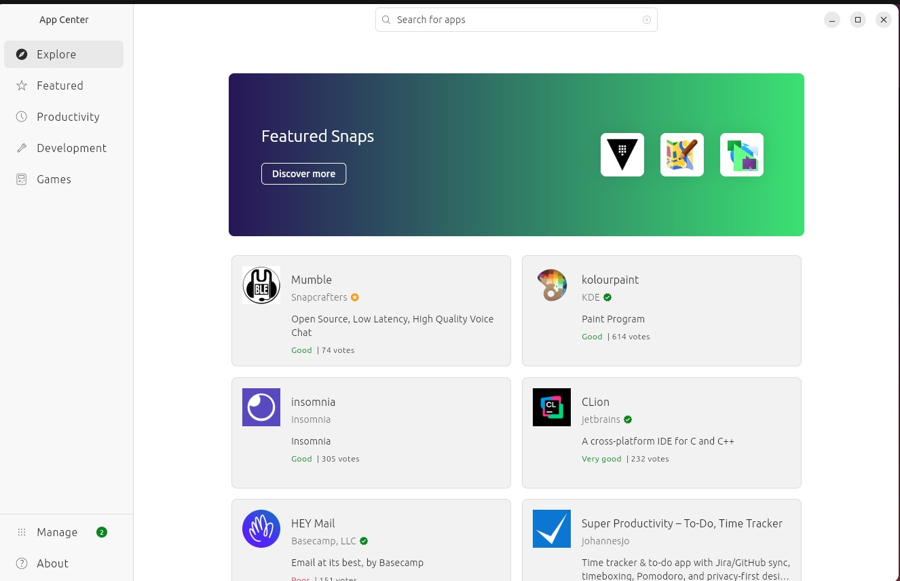
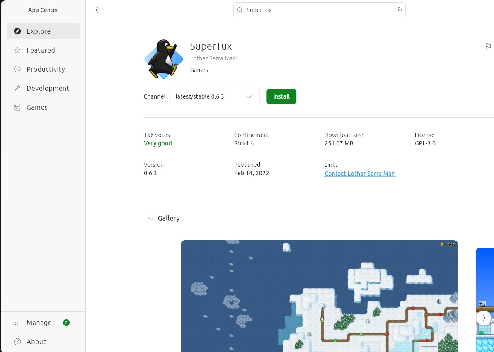
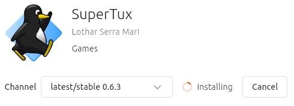
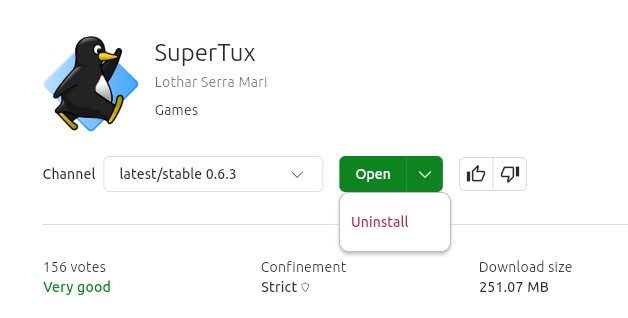

# Chapter 5: Installing Software (Building Your Toolkit) 📦🛠️

Here's where things get REALLY exciting! 🎉 YOU get to decide what software goes on YOUR computer! 💻 It's like building your own custom toolkit 🧰 with exactly the tools you need! Think of it like choosing your own superpowers! 🦸

## Why This Is a Superpower 💪✨

On most tablets 📱 and gaming consoles 🎮, someone else decides what apps you can use. 🚫 But on Ubuntu, YOU are in charge! 👑 YOU are the boss! You can:

- Install any software you want 📥 (with permission, of course! 👨👩)
- Try new programs whenever you're curious 🔍 (explore!)
- Remove programs you don't like ❌ (bye bye!)
- Customize your computer to work exactly how you want ⚙️ (YOUR way!)

This is REAL control! 🎮 This is YOUR computer doing what YOU want! 🌟 Not what a company tells you to do. Not limited by someone else's rules. YOUR COMPUTER, YOUR RULES! 👊

## The App Center 🏪✨



The **App Center** is Ubuntu's built-in app store — like Google Play or the App Store, but EVERYTHING IS FREE! 💰 There are thousands of programs to choose from! 🤯 It's like a candy store 🍬, but for software! (And it's all free candy! 🎁)

**Quick note:** The App Center mainly installs **Snap** packages — a modern, self-contained format. For some programs, you'll use the **Terminal** instead (we'll cover that later in this chapter! 💻).

### Opening the App Center 🔓

1. Click the Ubuntu logo to open Applications 📱
2. Search for "App Center" 🔍 or look for the blue bag icon 🛍️
3. The App Center opens! 🎉 (Welcome to software paradise!)



### Finding Cool Software 🔍🎯

The App Center has categories (organized like a library! 📚):

- **Audio & Video:** 🎵🎬 Music and video players, editors, recorders (multimedia magic!)
- **Developer Tools:** 💻 For coding and programming (future developer!)
- **Education:** 🎓 Learning apps and games (make learning fun!)
- **Games:** 🎮 All kinds of games! (playtime!)
- **Graphics & Photography:** 🎨📸 Drawing, painting, photo editing (artist tools!)
- **Productivity:** 📊 Office tools, organizers, note-taking (get stuff done!)
- **Science & Engineering:** 🔬🔧 Math, science, and engineering tools (brainy stuff!)

**Try This!** 🎯

1. Click on "Games" 🎮 (fun first!)
2. Browse and see what's available 👀 (so many options!)
3. Read descriptions 📖 to learn what each game does (knowledge is power!)

## Your First Installation: SuperTux 🐧🎮

Let's install your first program! 🎉 We'll start with **SuperTux**, a fun Mario-like game! 🍄 (Jump, run, and have a blast!)

**Step-by-Step Installation:** 📋 (Follow along! You got this! 💪)

1. Open the App Center 🏪
2. Click the search icon 🔍 (magnifying glass - detective mode!)
3. Type "SuperTux" ⌨️ (here we go!)
4. Click on SuperTux 🐧 when you find it (there it is!)



5. Read the description 📖 - it's a fun platformer game! (sounds awesome! 🎮)
6. Click "Install" 📥 (the magic button!)
7. You'll need to enter the computer password 🔐 (ask your parent if you don't know it!)
8. Wait for it to download and install ⏳ (patience! Good things take time! ⏰)



9. When it's done ✅, click "Open" 🚀 to play! (GAME ON!)
10. Or find it later 📱 in your Applications menu (it'll be waiting for you!)

**Congratulations!** 🎉🎊 You just installed your first program all by yourself! You're officially a software installer now! 🏆 How cool is that?!

## Awesome Programs to Install 🌟📦

Here are some programs kids LOVE! 💖 Try installing a few! (Software shopping spree! 🛍️)

### Games 🎮 (Fun time! 🎉)

**SuperTux** 🐧 (platformer like Mario)
- Jump and run through snowy levels ❄️ (winter adventure!)
- Free and fun! 🆓

**Minetest** ⛏️ (like Minecraft)
- Build and explore blocky worlds 🧱 (unlimited creativity!)
- Completely free Minecraft alternative! 💎

**0 A.D.** ⚔️ (strategy game)
- Build civilizations 🏛️ (empire builder!)
- Command armies 👥 (general mode!)
- Historical warfare game 🏺

**Frozen Bubble** 🫧 (puzzle game)
- Shoot colored bubbles 🎨 (aim carefully!)
- Match 3 or more to pop them! 💥 (satisfying!)

**SuperTuxKart** 🏎️ (racing game)
- Mario Kart style racing 🏁 (speed demon!)
- Fun characters and tracks 🎪

**Chess** ♟️
- Play chess against the computer 🤖 (strategic thinking!)
- Learn strategy 🧠 (become a grandmaster!)

### Creative Software 🎨✨ (Unleash your inner artist! 🖌️)

**Scratch** 🐱 (visual programming)
- Learn to code by making games 🎮 (code + games = FUN!)
- Drag and drop blocks to program 🧩 (no typing required!)
- Perfect for beginners! 🌟 (start your coding journey!)

**Blender** 🎬 (3D modeling)
- Create 3D models and animations 🎪 (movies! Games! Art!)
- Professional-quality tool, FREE! 💰🔥 (Hollywood uses this!)
- Steep learning curve but AMAZING! 🚀 (future 3D artist!)

**Inkscape** ✏️ (vector graphics)
- Create logos and drawings 🎨 (professional design!)
- Professional design tool 💼 (designer mode activated!)

**Krita** 🖌️ (digital painting)
- Better than GIMP for painting 🎨 (artist's choice!)
- Used by professional artists! 👨‍🎨 (pro tool!)

**MuseScore** 🎵 (music notation)
- Write sheet music 📝 (composer mode!)
- Compose your own songs 🎼 (make music!)

### Educational Software 🎓📚 (Learn while having fun! 🧠)

**GCompris** 🎮 (educational games)
- 100+ educational activities! 💯 (never get bored!)
- Math, reading, science, and more 🔬📖🔢 (learn everything!)
- Great for younger kids too! 👶 (family friendly!)

**KAlgebra** 🔢 (math tool)
- Solve math problems ➕➖✖️➗ (math wizard!)
- Graph equations 📈 (visualize it!)
- Learn algebra 📐 (become a math master!)

**Stellarium** ✨🔭 (planetarium)
- Explore the night sky 🌙⭐ (space explorer!)
- See constellations and planets 🪐 (astronomy adventure!)
- Learn astronomy! 🌌 (become a star expert!)

**Anki** 🃏 (flashcard app)
- Make flashcards to study 📝 (ace those tests!)
- Great for learning ANYTHING! 🧠 (memory master!)
- Uses spaced repetition 🔄 (scientifically proven!)

### Useful Tools 🛠️💡 (Practical power! ⚡)

**VLC Media Player** 🎬 (video player)
- Plays ANY video format! 📹 (seriously, ANY format!)
- Better than the default player 👍 (upgrade time!)
- Tons of features 🎛️ (power user alert!)

**GIMP** 🎨 (advanced photo editing)
- Like Photoshop but FREE! 💰 (professional without the price!)
- Edit and create images 🖼️ (photo wizard!)
- Professional quality! 💼 (industry standard!)

**Audacity** 🎙️ (audio editor)
- Record and edit sound 🔊 (audio pro!)
- Make podcasts 📻 (become a host!)
- Create music 🎵 (producer mode!)

**Kdenlive** 🎬 (video editor)
- Another video editor option 🎥 (try both!)
- Some people like it better than OpenShot 👍 (see what you prefer!)

**Thunderbird** 📧 (email app)
- Desktop email client 💻 (all your email in one place!)
- Manage multiple email accounts 📬 (organization champion!)

## Installing with the Terminal ⌨️💡

Some programs aren't in the App Center but can be installed using the **Terminal** — Ubuntu's command line. It sounds scary but it's actually really simple! 😎

### Opening the Terminal 🖥️

1. Click the Ubuntu logo to open Applications 📱
2. Search for "Terminal" 🔍
3. Open it — you'll see a black window with a blinking cursor ▮

### The Magic Install Command ✨

Type this and press Enter (replace `program-name` with what you want):

```
sudo apt install program-name
```

- **`sudo`** means "do this as administrator" 👑
- **`apt`** is Ubuntu's package manager 📦
- **`install`** means... install! 🎯

It will ask for your password 🔐, then download and install automatically. Easy! 🚀

**For example**, to install Audacity (the audio editor from Chapter 4):

```
sudo apt install audacity
```

**Or the Sound Recorder app:**

```
sudo apt install gnome-sound-recorder
```

**Don't worry** — you don't need to memorise these. When a program tells you to use `apt install`, just copy and paste! 📋

## How to Choose What to Install

With thousands of options, how do you decide? Ask yourself:

**What do I want to DO?**
- Make videos? Try OpenShot or Kdenlive
- Learn coding? Install Scratch
- Play games? Start with SuperTux or Minetest

**Read the description!**
- What does it do?
- Is it right for my age?
- Does it look interesting?

**Check reviews and ratings**
- See what other people think
- 4-5 stars usually means it's good

**Don't install EVERYTHING**
- Start with a few programs
- Learn to use them well
- Add more when you need them

## Removing Software You Don't Want ❌🗑️

Installed something you don't like? No problem! 🙅 It's YOUR computer - you can change your mind! 💭

**To uninstall software:** 🧹 (Clean sweep! ✨)

1. Open the App Center 🏪
2. Search for the program by name 🔍 (find it again!)
3. Click on it — instead of "Install" you'll see "Uninstall" ❌
4. Click "Uninstall" and confirm ✅ (bye bye!)



**It's gone!** 💨 Poof! Like magic! 🪄 You can always install it again later if you change your mind! 🔄 (No commitment issues here!)

**Try This!** 🎯

1. Install a small program 📥 (like Chess ♟️ or Solitaire 🃏)
2. Try it out 🎮 (give it a test drive!)
3. Practice uninstalling it ❌ (uninstall practice!)
4. Install it again if you liked it! ↩️ (no harm, no foul!)

## Building Your Personal Toolkit

Now it's time to think about what YOU want:

**For School:**
- LibreOffice (already installed)
- Anki for studying
- Math or science programs

**For Fun:**
- Games you like
- Music or video players
- Creativity tools

**For Creating:**
- Art programs
- Video editors
- Music makers
- Programming tools

**Challenge: Create Your Dream Setup**

Think about what you want to do with your computer, then:

1. Make a list of 5 programs you want to try
2. Install them one at a time
3. Try each one out for at least 10 minutes
4. Keep the ones you like
5. Remove the ones you don't

**Your computer should work for YOU, not the other way around!**

## Tips for Managing Software

**Keep it organized:**
- You can organize Applications into folders
- Right-click in the Applications menu to make new groups

**Update regularly:**
- The App Center will tell you when updates are available
- Updates fix bugs and add features
- Click "Update All" when you see the notification

**Don't install too much:**
- More software = less space on your hard drive
- More software = computer might run slower
- Quality over quantity!

**Be patient:**
- Big programs take time to download
- Installation can take a few minutes
- It's worth the wait!

## Installing Games: A Parent Note

**Hey Kids!** If you want to install games, make sure to ask your parents first. Some families have rules about gaming, and that's okay. Show them what you want to install so they can decide if it's appropriate.

**Hey Parents!** Ubuntu's App Center is curated and safe. All the games mentioned in this chapter are age-appropriate, open-source, and free. That said, your child should still ask permission before installing anything.

## What You Learned 📝🎓

You're officially a software installer now! 🏆 Here's your new knowledge:

- The **App Center** 🏪 has thousands of FREE programs! 💰 (endless possibilities!)
- You can **search** 🔍 for software or browse by category 📚 (find anything!)
- **Installing** 📥 is easy: find it, click Install, enter password, wait ⏰ (you got this!)
- You can **remove** ❌ software you don't want anymore (total control!)
- Build your **personal toolkit** 🛠️ with programs YOU choose (customize!)
- **You're in control** 👑 of what goes on your computer! (YOUR RULES!)

## Challenge Activities 🏆

**Easy:** 🟢 (Software Explorer level! 🧭)
1. Install one game 🎮 and play it for 15 minutes (fun time!)
2. Install one educational program 🎓 (learn something!)
3. Browse three different categories 📚 in the App Center (window shopping!)

**Medium:** 🟡 (Software Ninja level! 🥋)
1. Install 3 programs you've never tried 📦📦📦 (adventure time!)
2. Test each one and decide which you like best ⭐ (judge them!)
3. Remove the ones you don't want ❌ (quality control!)
4. Organize your Applications menu 📱 (clean and organized!)

**Hard:** 🔴 (Software Master level! 🧙‍♂️)
1. Install Scratch 🐱 and make a simple program (code it!)
2. Install Minetest ⛏️ and build something cool (creative mode!)
3. Install a creative tool 🎨 and make a project with it (create!)
4. Make a list 📝 of 10 programs you want to explore (wishlist!)
5. Write a short review ✍️ of your favorite new program (share your opinion!)

**Expert Challenge:** 💎 (Software Architect level! 🏗️)

**Build your perfect computer setup:** 🖥️✨

1. Think about what you want to do 🤔 (create, learn, play)
2. Research programs that match your goals 🔍 (hunt for the best!)
3. Install 5-10 carefully chosen programs 🎯 (quality selection!)
4. Learn to use at least 3 of them well 📚 (master them!)
5. Teach someone else how to use your favorite one 👨‍🏫 (spread the knowledge!)

Remember: This is YOUR computer! 💻 The software you choose makes it uniquely YOURS! 🌟 No two computers are exactly alike! 🎨

---

**What's Next:** 🚀 You've installed awesome software 📦 and built your perfect toolkit! 🛠️ Your computer is getting more YOU every day! 🎨 But wait - there's more! ✨ In Chapter 6, we'll make your computer LOOK amazing 💅 by customizing Ubuntu to match YOUR style! 🌈 Get ready to make your desktop absolutely gorgeous! 🎭

[← Back to Chapter 4](04-creating-things.md) | [Continue to Chapter 6 →](06-customizing-ubuntu.md)
